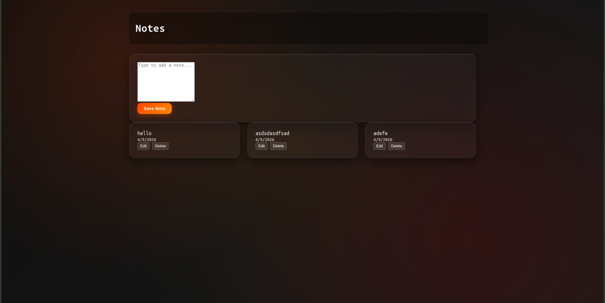

# Syntecxhub Notes App

A simple yet powerful notes application built with React and Vite. Create, edit, and delete your notes with persistent local storage. Perfect for quick note-taking and organizing your thoughts.
<!-- A section for imageof the app -->
.
## ✨ Features

- **Create Notes** - Add new notes with automatic timestamps
- **Edit Notes** - Modify existing notes on the fly
- **Delete Notes** - Remove notes you no longer need
- **Persistent Storage** - Notes are automatically saved to browser's local storage
- **Fast & Responsive** - Built with React and Vite for optimal performance
- **Clean UI** - Intuitive and user-friendly interface

## 🛠️ Tech Stack

- **React 19** - UI library for building interactive components
- **Vite** - Fast build tool and development server with HMR (Hot Module Replacement)
- **JavaScript (ES Modules)** - Modern JavaScript with module support
- **UUID** - Generate unique identifiers for each note
- **ESLint** - Code quality and linting

## 📦 Installation

1. **Clone the repository**
   ```bash
   git clone https://github.com/Shahriyar-Rahim/Syntecxhub_Notes-App.git
   cd Syntecxhub_Notes-App
   ```

2. **Install dependencies**
   ```bash
   npm install
   ```

3. **Start the development server**
   ```bash
   npm run dev
   ```

4. **Open in browser**
   Navigate to `http://localhost:5173` (or the port shown in your terminal)

## 🚀 Available Scripts

- `npm run dev` - Start development server with HMR
- `npm run build` - Build for production
- `npm run lint` - Run ESLint to check code quality
- `npm run preview` - Preview production build locally

## 📁 Project Structure

```
src/
├── App.jsx              # Main application component
├── App.css              # Application styles
├── Components/
│   ├── Header.jsx       # Header component
│   ├── AddNote.jsx      # Form for adding new notes
│   └── NotesList.jsx    # Display list of notes
├── main.jsx             # Entry point
└── index.css            # Global styles

public/                  # Static assets
vite.config.js          # Vite configuration
eslint.config.js        # ESLint configuration
package.json            # Project metadata and dependencies
```

## 💾 Data Persistence

Notes are automatically saved to your browser's **localStorage** under the key `fire-notes-data`. This means:
- Your notes persist across browser sessions
- No backend server required
- Data is stored locally on your device

## 🎯 How It Works

1. **Add a Note** - Enter your text in the input field and click "Add"
2. **View Notes** - All your notes appear in the notes list with timestamps
3. **Edit a Note** - Click the edit button to modify an existing note
4. **Delete a Note** - Click the delete button to remove a note permanently

## 🔧 Development

### Adding New Features

To extend this app, consider:
- Implementing note categories/tags
- Adding search and filter functionality
- Exporting notes to different formats
- Adding a dark mode toggle

### Code Quality

This project uses ESLint to maintain code quality. Run linting with:
```bash
npm run lint
```

## 📋 Node & NPM Versions

- **Node.js**: v16+ recommended
- **NPM**: v7+

## 🤝 Contributing

Contributions are welcome! Feel free to:
1. Fork the repository
2. Create a feature branch (`git checkout -b feature/AmazingFeature`)
3. Commit your changes (`git commit -m 'Add AmazingFeature'`)
4. Push to the branch (`git push origin feature/AmazingFeature`)
5. Open a Pull Request

## 📝 License

This project is open source and available under the [MIT License](LICENSE).

## 📞 Contact & Support

- **Author**: [Shahriyar-Rahim](https://github.com/Shahriyar-Rahim)
- **Repository**: [Syntecxhub_Notes-App](https://github.com/Shahriyar-Rahim/Syntecxhub_Notes-App)

For issues, bugs, or feature requests, please open an [Issue](https://github.com/Shahriyar-Rahim/Syntecxhub_Notes-App/issues) on GitHub.

## 🎓 Learning Resources

- [React Documentation](https://react.dev)
- [Vite Guide](https://vitejs.dev)
- [UUID Package](https://www.npmjs.com/package/uuid)
- [Web Storage API](https://developer.mozilla.org/en-US/docs/Web/API/Web_Storage_API)

---

**Happy Note-Taking! 📝**